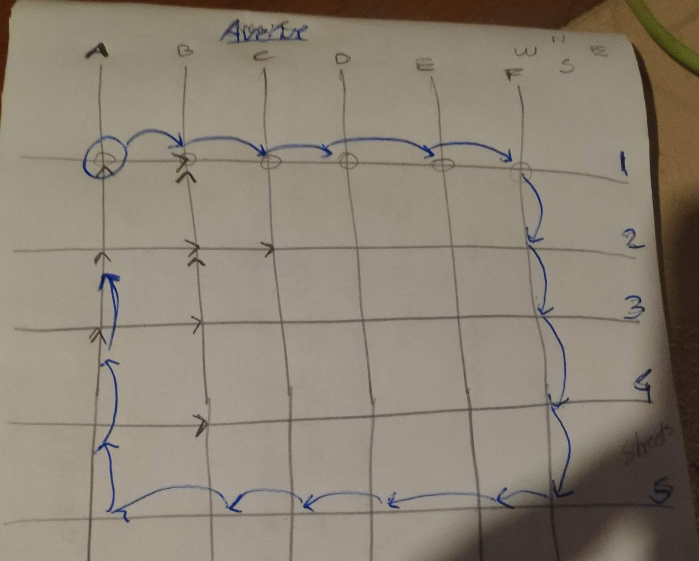

# Topl-Traffic-Data
Topl Traffic Data Exercise


## Candidate
- Fernando Torterolo

## Interviewer
- Mark Grand, 7 sept 2022


## Compile

> sh ./compile.sh

## Run

Script allow 2 or 3 arguments, and must follow order:

1. from node  (required)
2. to node    (required)
3. optional data source file, dataset provided is used as default

Examples:

```shell
➜  Topl-Traffic-Data git:(main) ✗ sh ./run.sh  --to A2 --from A1
Welcome: using dataset provided
{
  "nodes" : "A1,B1,C1,D1,E1,F1,F2,F3,F4,F5,E5,D5,C5,B5,A5,A4,A3,A2",
  "edges" : "A1~>B1 %35.32789981760104,B1~>C1 %21.13861471145225,C1~>D1 %85.00295953089719,D1~>E1 %35.17336993782976,E1~>F1 %55.07645982590486,F1~>F2 %29.0873275798061,F2~>F3 %68.34548387873134,F3~>F4 %21.3803403614159,F4~>F5 %71.84295680303838,F5~>E5 %22.98262478262783,E5~>D5 %24.63585459342439,D5~>C5 %81.16794848954652,C5~>B5 %15.02799299609704,B5~>A5 %46.05019171625838,A5~>A4 %26.67924826255867,A4~>A3 %66.67536448347022,A3~>A2 %64.36139748972634",
  "weight" : 769.9560352603861
}


```




## TODOs

1. Best Cli support, find a library to handle console arguments, with help, and parsing support.


## how to test

```shell

sbt:topl-traffic-data> Test/test
[info] compiling 1 Scala source to /home/fernando/development/Topl-Traffic-Data/target/scala-2.13/classes ...
[info] compiling 5 Scala sources to /home/fernando/development/Topl-Traffic-Data/target/scala-2.13/test-classes ...
+ JsonSpec
  + Json Spec validation
+ FileRepositorySpec
  + Average partial sample data 2
  + Parse partial sample data
  + Parse sample data provided
  + Average sample data provided
+ GraphSpec
  + Graph Spec Example
+ Graph Traffic Spec
  + Path and Short Path with Partial Sample Data 2
  + Path and Short Path with Sample Data
8 tests passed. 0 tests failed. 0 tests ignored.
Executed in 3 s 298 ms
```

### Notes

In the process of create the solution, I evaluate these alternatives
- learn Shortest-path_tree different algorithms and implement myself.
- copy paste from from some internet tutorial  , this is a good one https://www.ummels.de/2015/01/18/dijkstra-in-scala/
- Use a tested, official community library for scala, http://www.scala-graph.org/    (I choose this)
 

why? Because I don't want to reinvent the wheel, and not copy and paste, create a solution for a problem takes time, and I don't think is what you are looking for.
So, I choose to learn how to use a library, if you ask me which algorithm they use?, Dijkstra approach using tail recursive operation with priority Queues,  

- shortest path search	O(VlogV + E)
- http://www.scala-graph.org/guides/core-characteristics.html

details: https://github.com/scala-graph/scala-graph/blob/ac445c719f9da65c52188c7cafae0d76c59d0161/core/src/main/scala/scalax/collection/TraverserImpl.scala#L309


## Instructions for Traffic Data Exercise
This is a programming exercise that involves reading a data file that contains information about the traffic flow on some fictitious city streets. 
To keep this simple, the streets are all one-way. 
The program is to be written in Scala using a functional style of programming.

The streets are mostly in a grid pattern. 
Streets identified by numbers (1, 2, 3, ...) run from east to west or from west to east with Street 1 being the northernmost street. 
Avenues identified by letters (A, B, C, ...) run from north to south or from south to north, with avenue A being the westernmost avenue. 
There is also an elevated expressway that connects more than two intersections and does not follow the grid pattern.

The program will need to read the data and then find good routes between different pairs of intersections. 
Intersections are identified by the names of the avenue and street that intersect at the intersection. 
For example, an intersection may be identified by the combination of Avenue F and street 24.

The input to the program will consist of the data file and two intersections. 
It must be possible to specify the location of the data file and the names of the two intersections on the command line. 
The program output will describe a good route to travel from the first intersection to the second.

##  Detailed requirements
The program will begin by reading a data file. 
You can copy the data file from this link and have the program read the local copy or you can have the program read the file from the URL. 
Either is acceptable.

The data file contains data that describes the flow of traffic through the streets measured at different points in time. 
The format of the data is JSON. 
It looks like this:

```json
{
  "trafficMeasurements": [
    {
      "measurementTime": 83452,
      "measurements": [
        {
          "startAvenue": "A",
          "startStreet": "1",
          "transitTime": 59.57363899660943,
          "endAvenue": "A",
          "endStreet": "2"
        },
        {
          "startAvenue": "A",
          "startStreet": "2",
          "transitTime": 40.753916740023314,
          "endAvenue": "A",
          "endStreet": "3"
        }
    ⋮
    ]
    },
    {
      "measurementTime": 83556,
      "measurements": [
        ⋮
      ]
    }
  ]
}
```
The file contains a single JSON object. The JSON object has a field named trafficMeasurements. 
The field's value is an array of JSON objects. 
Each JSON object contains a set of traffic flow measurements made at a different point in time. 
The first element of the array is the earliest measurement set. The last element of the array is the most recent measurement set.

These measurement set objects contain a measurementTime field that indicates when the measurements were made. 
The measurement set objects also contain a measurements field that is an array of objects that correspond to the individual measurements.

These measurement objects each correspond to a road segment that goes from one intersection to another. 
The startAvenue and startStreet fields identify the intersection that the road segment goes from. 
The endAvenue and endStreet fields identify the intersection that the road segment goes to. 
The value of the transitTime field is the amount of time it is taking to traverse the road segment.

When the program is selecting a good route from one intersection to the other, it should select the route with the smallest total transit time.
The transit times for each road segment vary from one measurement to the next. 
You should base the transit time on some sort of average for each road segment.

If you feel that it will take too long to write code to find the best route, write the program to find any route. 
If you choose this option, expect that during our technical interview we will ask you how you would change it to find the fastest route.

The output of the program should be JSON. It should include:

- the starting intersection
- the ending intersection
- an array that contains the sequence of road segments to be traversed to get from the starting intersection to the ending intersection.
- the total transit time based on the road segments in the route


## Submission Instructions
The program is to be written in Scala. Use a functional style of programming. Unit tests will impress us.

When the program is done, check it into a public GitHub repository. Send an email with the URL of the repository to hiring@topl.me
